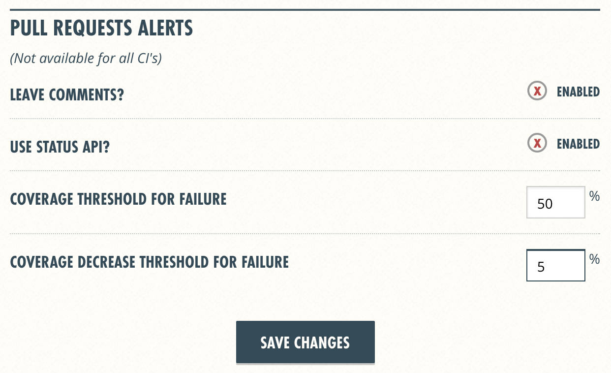

[](https://travis-ci.org/gopl/ci)
[](https://coveralls.io/github/gopl/ci)
[](http://godoc.org/github.com/gopl/ci)
[](https://goreportcard.com/report/github.com/gopl/ci)
[](https://landscape.io/github/gopl/ci/master)


## 1 配置 Travis CI

* 添加 .travis.yml
```yaml
language: go
```

* 使用 GitHub 账号登陆 [Travis CI](https://travis-ci.org/)，获取 gopl 组织访问权限

* [添加仓库](https://travis-ci.org/profile/gopl)

	将 gopl/ci 设置为打开状态

* 设置 Build Status

	访问 [Travis 仓库](https://travis-ci.org/gopl/ci)，点击图标，选择 Markdown，复制、粘贴到 README.md 顶部


#### 参考资料

- 《GitHub 入门与实践》
- [Getting started](https://docs.travis-ci.com/user/getting-started/)
- [Building a Go Project](https://docs.travis-ci.com/user/languages/go)
- [Customizing the Build](https://docs.travis-ci.com/user/customizing-the-build/)


## 2 配置 Coveralls

* 修改 .travis.yml

```yaml
language: go
sudo: false
go:
  - 1.8.1
before_install:
  - go get github.com/mattn/goveralls
script:
  - goveralls -service=travis-ci
```

* 使用 GitHub 账号登陆 [Coveralls](https://coveralls.io/)，获取 gopl 组织访问权限

* [添加仓库](https://coveralls.io/repos/new)

	将 gopl/ci 设置为 ON 状态

* 设置 Coverage Status

	访问[仓库设置](https://coveralls.io/github/gopl/ci/settings)，点击状态图标后面的 EMBED 下拉框，选择 MARKDOWN，复制、粘贴到 READMED.md 顶部

* 设置覆盖率阈值

	可以设置[覆盖率阈值](https://coveralls.io/github/gopl/ci/settings)，当覆盖率小于某百分比，或覆盖率比上一次降低了多少百分比，就认为此次构建失败
	


#### 参考资料

- [goveralls](https://github.com/mattn/goveralls)
- [INSTRUCTIONS FOR USING TRAVIS](https://coveralls.zendesk.com/hc/en-us/articles/201342809-Go)


## 3 使用 glide 管理依赖

* 修改 .travis.yml

```yaml
language: go
sudo: false
go:
  - 1.8.1
before_install:
  - go get github.com/mattn/goveralls
  - go get github.com/Masterminds/glide
install:
  - glide install -v
script:
  - goveralls -service=travis-ci
```

* 执行 glide 命令
```bash
glide create
glide up -v
```

* .gitignore 忽略 /vendor 目录


#### 参考资料

- [Glide Documentation](http://glide.readthedocs.io/en/latest/)


## 4 静态代码分析

使用 [gometalinter](https://github.com/alecthomas/gometalinter) 执行分析

* 修改 .travis.yml

```yaml
language: go
sudo: false
go:
  - 1.8.1
before_install:
  - go get github.com/mattn/goveralls
  - go get github.com/Masterminds/glide
  - go get -u github.com/alecthomas/gometalinter
  - gometalinter --install
install:
  - glide install -v
script:
  - gometalinter --config=config.json ./...
  - goveralls -service=travis-ci
```

* 添加 gometalinter 配置文件 config.json -- 按项目需要配置 Enable 列表，指定执行哪些检查工具
```json
{
  "Vendor": true,
  "DisableAll": true,
  "Enable": ["goimports", "golint", "vet", "vetshadow", "deadcode", "gosimple"]
}

```


#### 参考资料

- [Go for Visual Studio Code](https://github.com/Microsoft/vscode-go)
- [An incomplete list of Go tools](https://dominik.honnef.co/posts/2014/12/go-tools/)


